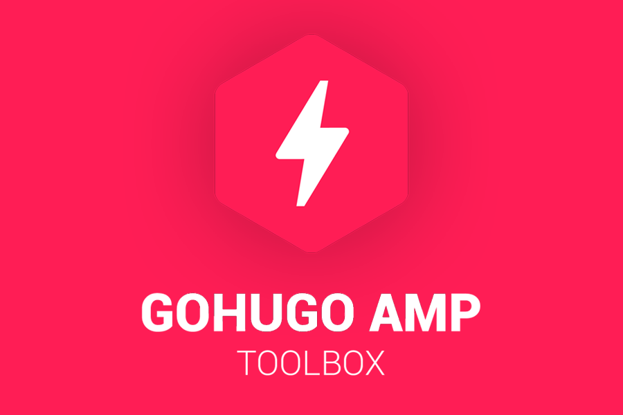

# gohugo-amp
⚡ AMP starter theme for gohugo https://gohugo-amp.gohugohq.com



This Hugo theme is supposed to be a starter theme to make it easy to adapt to [Google's AMP-Project](https://www.ampproject.org/). Included in the theme are [**40+ shortcodes and partials**](/shortcodes/) and [automatic Structured Data](/schema/) making it a pleasure to embed AMP-Elements within your content files or your template.

## Installation

Go to the directory where you have your Hugo site and run:

```
$ mkdir themes
$ cd themes
$ git clone https://github.com/wildhaber/gohugo-amp.git
$ rm -rf gohugo-amp/.git
```

An extended [theme documentation]((https://gohugo-amp.gohugohq.com)) at [gohugo-amp.gohugohq.com](https://gohugo-amp.gohugohq.com). For more information about the theme installation read the official [setup guide](https://gohugo.io/overview/installing/) of Hugo.

## Configuration

After installing the theme successfully, we recommend you to take a look at the [Kitchen Sink](https://gohugo-amp.gohugohq.com/kitchen-sink). You find extensive documentation and a demonstration of all shortcodes and partials there.

For some features, you need to add configuration to your base `config.toml` params section:

```toml
[params]
    amp = true # enables amp features
    ampCdnRoot = "https://cdn.ampproject.org/" # defined base cdn root of the amp projects files
    ampRelease = "v0" # define amp release you want to use
    ampElementsVersion = "0.1" # define amp-elements version you want to use
    
    # define which amp-elements you are using globally, these elements will be included in every page
    ampElements = ["amp-accordion","amp-ad","amp-analytics","amp-carousel","amp-iframe","amp-app-banner","amp-dynamic-css-classes","amp-form","amp-fx-flying-carpet","amp-image-lightbox","amp-lightbox","amp-sidebar","amp-social-share","amp-sticky-ad","amp-user-notification"]

    themeColor = "#112233" # define a theme color (this will colorize the android address-bar)

    adsensePublisher = "ca-pub-123456789" # required if you want to include google adsense
    googleAnalytics = "UA-123456-78" # required if you want to use google analytics
    appleItunesApp = "app-id=123456789, app-argument=app-name://link/to/app-content" # required if you want to add an app banner with iOS app
    ampManifest = "/amp-manifest.json" # required if you want to add the app-banner feature
    
    alternatePageName = "HUGO AMP" # alternative name for website structured data
    organisationLogo = "https://gohugohq.com/logo.png" # set organisation logo for structured data
    organisationName = "gohugohq.com" # set organisation name
    organisationAddress = "Some Street 123, 12345 City" # set organisation address

    socialProfiles = ["http://www.facebook.com/your-profile","http://instagram.com/yourProfile","http://www.linkedin.com/in/yourprofile","http://plus.google.com/your_profile"]  # for sameAs in organisation's structured data
    
    publisherName = "gohugohq.com" # publisher used in article schema
    publisherLogo = "https://gohugo-amp.gohugohq.com/logo-publisher.png" # https://developers.google.com/search/docs/data-types/articles#logo-guidelines
    publisherLogoWidth = 600 # logo width
    publisherLogoHeight = 60 # logo height
    
```


### Styling

AMP does not allow you to include CSS styles with the regular `link rel='stylesheet'`-tag we need to embed the CSS in the header section.

For this case add a file in your regular `layouts/partials/`-folder called `stylesheet.html`. In this file you can write pure CSS (no `<styles>`-Tags required) 

Since its not a cool idea have to write your stylesheets in an HTML-File we provide an automated process rendering your Sass output directly in this file. You can read more in our [Guide about Styling](https://gohugo-amp.gohugohq.com/styling/) in the documentation.


### Google Analytics

Beside of adding the googleAnalytics in your base `config.toml` you also need to define triggers. Simply add a file in your base data section `/data/analytics/triggers.json`. For example:

```json
{
  "trackPageview": {
    "on": "visible",
    "request": "pageview"
  },
  "trackEvent" : {
    "selector": "body",
    "on": "click",
    "request": "event",
    "vars": {
      "eventCategory": "body-click",
      "eventAction": "click"
    }
  }
}
```

Further information about AMP Analytics you will find in the [official documentation of the amp-project](https://www.ampproject.org/docs/reference/components/amp-analytics).

## App-Banners

App-Banners are very popular and help you to win your regular website's visitor downloading your app. Simply add a file in your base data section `/data/app/banner.json` for the configuration to display it in a mobile browser:

```json
{
  "id" : "app-banner-id",
  "src" : "https://placehold.it/60x51/ff3300/cccccc",
  "name" : "My Apps Name",
  "description" : "Short app description. Really short.",
  "openText" : "get the app"
}
```

Further information about AMP App-Banners you will find in the [official documentation of the amp-project](https://www.ampproject.org/docs/reference/components/amp-app-banner).

## Contributing

Have you found a bug or got an idea for a new feature? Feel free to use the [issue tracker](https://github.com/wildhaber/gohugo-amp/issues) to let me know. Alternatively, make a [pull request](https://github.com/wildhaber/gohugo-amp/pulls) directly.

## License

gohugo-amp released under the [MIT License](LICENSE).

## Thanks

Thanks to [Steve Francia](https://github.com/spf13) for creating Hugo and the awesome community around the project.